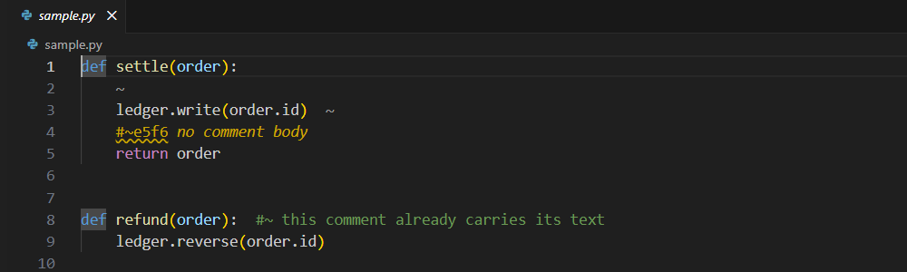
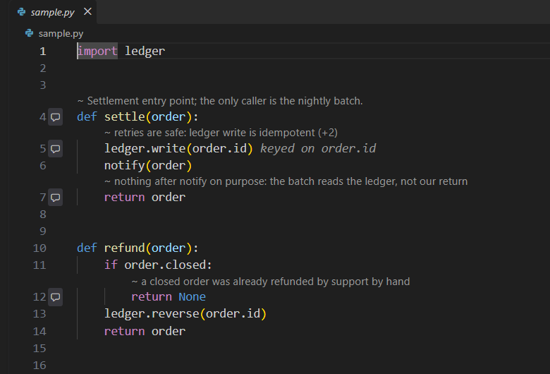

# Slopstash

Stash the slop, keep the context. Slopstash keeps AI-written comments out of your code
without deleting them.

Coding agents write a lot of comments. A few carry context the next reader needs; most are
noise to the person who owns the code. Deleting them throws the context away, and keeping
them clutters every file. Slopstash moves the text of each AI comment into a tracked
markdown file and leaves a short marker in the code. Agents still read and write the full
comments inline, at no extra token cost. Your own checkout stays clean, and a VS Code
extension shows the comments as an overlay when you want them.

Overlay off: each marker collapses to a dim `~`.



Overlay on: the comments render in place.



## How it works

Agents mark their comments with a sigil: `#~` in Python, `//~` in TypeScript, JavaScript,
C#, and Java. A git filter handles the rest.

```text
What is committed, and your checkout       An agent worktree
  def settle(order):                         def settle(order):
      #~a1b2                                     #~a1b2 retries are safe: ledger write is idempotent
      ledger.write(order.id)  #~c3d4             ledger.write(order.id)  #~c3d4 keyed on order.id

.agents/comments/src/settle.py.md
  ## a1b2
  retries are safe: ledger write is idempotent
  ## c3d4
  keyed on order.id
```

- **On commit** the filter reduces each sigil comment to `#~` plus a four-character id. The
  pre-commit hook writes the text to `.agents/comments/<path>.md` and stages it.
- **In an agent worktree** (made with `slopstash worktree add`) the filter expands the
  markers back into full comments on checkout, so agents read, grep, and edit real text on
  disk. `git diff` there still shows only markers.
- **In your checkout** the files hold bare markers. The VS Code extension draws the text
  over them, and the hover shows the full comment and who wrote it.

Nothing is deleted at any point: every comment body is in a tracked, human-readable file.

## Quickstart

Needs git and Node 22 or later.

```sh
npm install -g slopstash
cd your-repo
slopstash init                          # filter, merge driver, .gitattributes, pre-commit hook
git add .gitattributes && git commit -m "Set up Slopstash"
slopstash worktree add ../agent -b agent  # a checkout for agents, with full comments
```

`init` prints every change it makes; `slopstash init --dry-run` shows the list first and
changes nothing. Git config and the hook are local to your clone. Everyone who clones the
repository runs `slopstash init` once. Clones without it still work: they see bare
markers, and [`check`](#keeping-the-repository-consistent) catches anything they commit
wrong.

Point your agent at `../agent`. The comments it writes as `#~ like this` commit as bare
markers, with the text in `.agents/comments/`.

Then install **Slopstash: Hide AI Comments** from the VS Code Marketplace. Toggle the
overlay with the `AI comments` status bar item or `Ctrl+Alt+`` ` (`Cmd+Alt+`` ` on macOS).

## Agent setup

Agents do not have to know about the sigil. A post-edit hook runs `slopstash tag` on each
file the agent edits: comments new since the index become sigil comments, and each
sidecar entry records the harness, model, session, and time.

| Harness | Setup | Where the hook goes |
| --- | --- | --- |
| Claude Code | `slopstash init --hooks claude-code` | `.claude/settings.local.json` (`PostToolUse` on Edit, Write, MultiEdit) |
| Codex CLI | `slopstash init --hooks codex`, then trust the hook in Codex with `/hooks` | `.codex/hooks.json` (`PostToolUse` on apply_patch, Edit, Write) |
| Cursor | `slopstash init --hooks cursor` | `.cursor/hooks.json` (`afterFileEdit`) |
| Anything else | `slopstash init --agents-md` teaches the sigil in `AGENTS.md`; or run `slopstash tag --changed` after the agent's turn | |

Combine them: `slopstash init --hooks claude-code,codex,cursor --agents-md`. Hooks see only
edits made through the harness's own edit tools. A comment an agent writes with `sed` or a
script is picked up by `tag --changed`, or by the pre-commit hook if it already carries the
sigil.

## Cleaning up an existing repository

`scan` lists comments that read as AI-written: step-by-step narration, change-history
phrasing ("Updated to", "NEW:"), emoji, and hedging aimed at the reader. It never proposes
doc comments, pragmas, suppression directives, license headers, ticketed TODOs, or
commented-out code.

```sh
slopstash scan                          # review the list
slopstash scan --json > review.json     # set "accept": false on the ones to keep
slopstash scan --apply review.json      # stash the rest; rejected ones are not proposed again
slopstash scan --mark-all               # or stash every unprotected comment without review
```

In VS Code, the **AI Comment Review** view in the Explorer runs the same flow. Single
comments move either way with `slopstash demote <file>:<line>` and `slopstash promote <id>`,
or with the code actions on a comment.

## Stale comments

Each sidecar entry records a hash of the code its comment sits on. When that code changes
and the comment does not, the comment is flagged as possibly stale. Reformatting does not
count. Agents see `#~ab12 [stale?] ...` in their worktree, and the overlay marks the comment
in the warning color.

```sh
slopstash check --stale      # list flagged comments; exits 1 when there are any
slopstash confirm ab12       # the comment is still right: clear the flag
```

## Keeping the repository consistent

`slopstash check` reads what is committed (the index) and fails on three problems:

- a sigil comment committed with its text, from a clone without the filter;
- a marker whose body is missing, usually after a file was renamed or moved;
- a body whose marker is gone.

`slopstash check --fix` moves a body to the file its marker moved to and drops bodies no
marker references, then stages the result. The pre-commit hook runs exactly that, so in a
clone with `init` you rarely see these problems at all.

In CI, run it on every push:

```yaml
- uses: actions/checkout@v4
- uses: actions/setup-node@v4
  with:
    node-version: 22
- run: npx --yes slopstash@0.1 check
```

Or use the action in this repository, which does the same:
`uses: Pawls/slopstash@v0.1`. Pass `args: --stale` in a second step to fail on stale
comments too.

## Removing Slopstash

```sh
slopstash promote --all      # optional: turn every AI comment back into an ordinary comment
slopstash uninstall          # undo init: config, hook, .gitattributes lines, harness hooks, AGENTS.md section
```

`uninstall --dry-run` lists the changes first. Uninstalling leaves `.agents/comments/` and
the markers alone; they are your data. Without `promote --all`, the markers stay in the
code as short, harmless comments.

## FAQ

**Does this cost agents tokens?** Not in an agent worktree: the comments are ordinary text
on disk, so reading one costs what the comment always cost, and no agent needs to open a
sidecar. An agent working in a collapsed checkout sees only the markers (about seven
characters each) and would have to open `.agents/comments/` to read a body. Give agents
their own worktree.

**What stays in the repository?** The markers in the code, the sidecars under
`.agents/comments/`, `.agents/scan-ignore` if you have used `scan`, and a few lines in
`.gitattributes`. The filter, merge driver, and pre-commit hook live in your local git
config and hooks directory, and harness hooks in the harness's settings file.

**What if a teammate does not install it?** Their checkout shows bare markers, and their
commits skip the filter. A comment they write with the sigil, or a file they rename, is
caught by `check` in CI; running `slopstash init` in their clone fixes it for good.

**What happens when two branches edit the same comment?** `init` installs a merge driver
for the sidecars: entries merge by id, and a body both branches changed gets conflict
markers inside that body. A clone without `init` falls back to git's ordinary text merge.

**Can I keep the bodies out of the repository entirely?** Add `.agents/comments/` to
`.gitignore`. The markers then dangle by design, and `check` stops asking for bodies.

**Which languages?** Python, TypeScript (including TSX), JavaScript, C#, and Java.

**Does a hook or `init` touch other repositories?** No. With a global `core.hooksPath`,
`init` chains any hook already there and the managed hook does nothing in repositories
without Slopstash's filter.

## Development

- [Design, decisions, and measurements](docs/design.md)
- [v1 plan](docs/plans/v1.md)
- [Notes for contributors and agents](AGENTS.md)

```sh
npm install && npm test      # build, bundle, unit and git integration suites
npm run test:vscode          # extension end-to-end tests in a downloaded VS Code
```

## License

MIT
